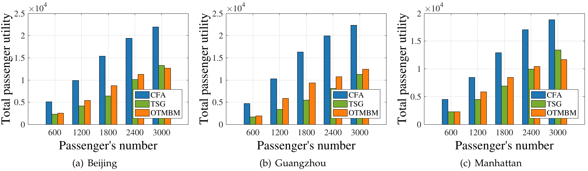
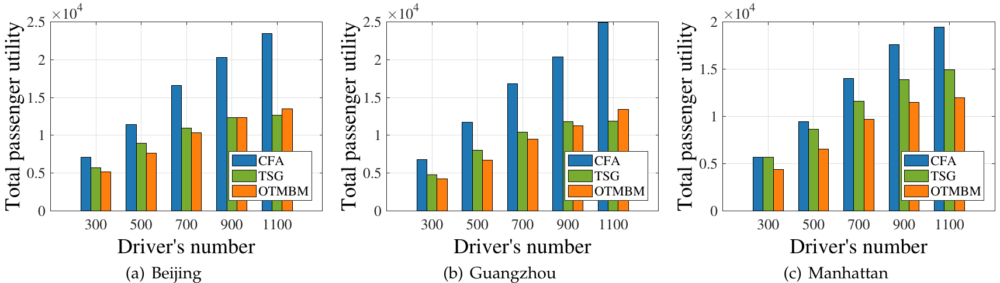

# D-SPAC

## Dataset

- Beijing: This dataset contains the GPS trajectories of 10,357 taxis during the period of Feb. 2 to Feb. 8, 2008 within Beijing. The total number of points in this dataset is about 15 million and the total distance of the trajectories reaches to 9 million kilometers. The data can be found in [T-Drive trajectory data sample](https://www.microsoft.com/en-us/research/publication/t-drive-trajectory-data-sample/).
- Guangzhou: This  dataset contains 32 million taxi operating records in Guangzhou from Feb. 1st to Feb. 7, 2017. Please refer to [guangzhou trajectory data](./guangzhou_trajectory_data) for details.
- New York City: This dataset is based on the 2016 New York city yellow cab trip record data in Manhattan, which was originally published by the New York City Taxi and Limousine Commission. The data can be found in [New York City Taxi Trip Duration](https://www.kaggle.com/c/nyc-taxi-trip-duration/data).

## Code

The source code for algorithms CFA, TSG and OTMBM is contained in folder [carpooling](./carpooling).

The source code for algorithm DRL is contained in folder [python](./python).

## Result

